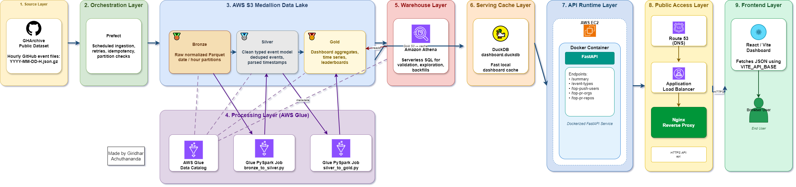
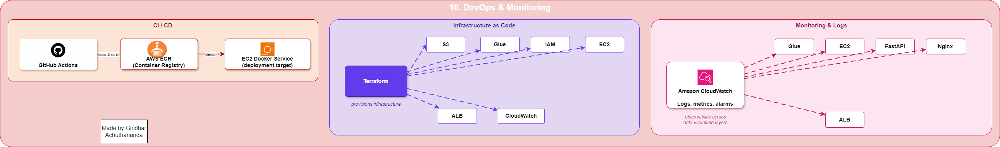
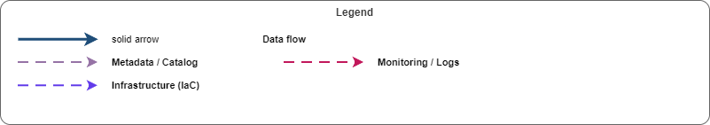

# GitHub Analytics Pipeline

This project is a cloud-native analytics pipeline for GHArchive data. The idea is simple: GitHub publishes public event data every hour, and this system turns those raw hourly files into clean analytics tables, fast API responses, and dashboard-ready metrics.

I built it like a real data engineering project instead of just writing one script that downloads data. The pipeline has a bronze, silver, and gold data model, runs batch processing with Prefect and Glue, stores data in S3, exposes analytics through FastAPI, and includes Terraform and CI workflows so the whole thing can be deployed in a repeatable way.

## What The Project Does

At a high level, the project answers questions like:

- How many GitHub events happened in a selected time window?
- Which event types are most common?
- Which users are pushing the most code?
- Which organizations and repositories are getting the most pull request activity?
- How does activity change by hour or by day?

The frontend should not know anything about S3, Athena, Glue, or DuckDB. It just calls clean REST endpoints like:

```text
/api/gh/summary?preset=7d
/api/gh/event-types?preset=7d
/api/gh/top-push-users?preset=7d
```

Everything behind those endpoints is handled by the data pipeline.

## System Walkthrough

The source data comes from GHArchive:

```text
https://data.gharchive.org/YYYY-MM-DD-H.json.gz
```

Each file contains one hour of public GitHub events. The pipeline checks which hourly files are ready, downloads the missing ones, converts them into Parquet, and uploads them into S3.

The full path looks like this:

```text
GHArchive hourly files
  -> Prefect ingestion flow
  -> S3 bronze Parquet
  -> Glue Data Catalog
  -> Glue PySpark silver transformation
  -> S3 silver event model
  -> Glue PySpark gold aggregation
  -> S3 gold dashboard tables
  -> Athena analytical warehouse
  -> DuckDB dashboard cache
  -> FastAPI Docker service
  -> Nginx and AWS Load Balancer
  -> React dashboard
```

The reason for this design is separation of responsibility. S3 stores the lake, Glue handles distributed transforms, Athena gives a serverless SQL layer, DuckDB makes dashboard serving fast, FastAPI owns the product API, and the frontend only renders the experience.

## Architecture

The main architecture diagram shows the full data path from GHArchive ingestion to the dashboard API and frontend.



How CI/CD, container builds, Terraform, monitoring, and runtime services fit around the data platform:



Legend:



## Data Lake Design

The data lake follows a Medallion model.

### Bronze

Bronze is the first structured copy of the data. It is still close to the original GHArchive event stream, but stored as partitioned Parquet instead of compressed JSON.

```text
s3://<bucket>/bronze/gharchive/date=YYYY-MM-DD/hour=H/part-000.parquet
```

This layer is useful because it gives us a reliable replay point. If the silver or gold logic changes later, the downstream tables can be rebuilt from bronze.

### Silver

Silver is the cleaned event model. This is where timestamps are parsed, event IDs are deduplicated, bot flags are added, and columns are typed properly.

```text
s3://<bucket>/silver/events/event_day=YYYY-MM-DD/hour=H/
```

This is the table I would use for exploratory analysis or for creating new metrics.

### Gold

Gold is the dashboard layer. It stores pre-aggregated tables so that the API does not need to scan raw event-level data on every request.

```text
s3://<bucket>/gold/event_type_daily/
s3://<bucket>/gold/event_type_hourly/
s3://<bucket>/gold/push_user_daily/
s3://<bucket>/gold/pr_org_daily/
s3://<bucket>/gold/pr_repo_daily/
```

These tables are intentionally small and shaped around the dashboard.

## API Layer

The FastAPI service reads from a local DuckDB dashboard cache. DuckDB is built from the gold Parquet tables and gives the API predictable low-latency reads.

Current endpoints:

```text
GET /health
GET /api/gh/summary?preset=7d
GET /api/gh/event-types?preset=7d
GET /api/gh/event-types-daily?preset=7d
GET /api/gh/top-push-users?preset=7d&limit=10
GET /api/gh/top-pr-orgs?preset=7d&limit=10
GET /api/gh/top-pr-repos?preset=7d&limit=10
```

Supported dashboard presets:

```text
1h, 4h, 24h, 7d, 30d, max
```

Short presets use hourly aggregates. Longer presets use daily aggregates.

## Why DuckDB If Athena Already Exists?

Athena is great for warehouse queries, validation, and backfills. It is not always the best choice for a dashboard request that should return quickly every time.

So the project uses both:

- Athena for serverless SQL on S3
- DuckDB as a compact serving cache for FastAPI

That keeps the architecture practical. The data lake remains the source of truth, while the API gets a fast local database optimized for dashboard reads.

## Local API Development

```bash
cd api
python -m venv .venv
source .venv/bin/activate
pip install -r requirements.txt
export DASHBOARD_DB_PATH=../data/dashboard.duckdb
export FRONTEND_ORIGINS=http://localhost:5173
uvicorn app.main:app --reload --host 0.0.0.0 --port 8000
```

## Docker

```bash
docker build -t github-analytics-api ./api
docker run --rm -p 8000:8000 \
  -e DASHBOARD_DB_PATH=/data/dashboard.duckdb \
  -e FRONTEND_ORIGINS=https://<your_frontend_domain_here> \
  -v $(pwd)/data:/data \
  github-analytics-api
```

## Terraform Deployment

```bash
cd infra/envs/prod
terraform init
terraform plan \
  -var="aws_region=us-east-1" \
  -var="project_name=github-analytics"
terraform apply
```

The Terraform code provisions the main AWS pieces used by the platform:

- S3 data lake bucket
- IAM roles and instance profile
- Glue database and jobs
- EC2 API host
- Application Load Balancer
- CloudWatch log groups and alarm skeletons

## Running The Pipeline

Deploy the ingestion flow:

```bash
cd ingestion
pip install -r requirements.txt
export AWS_REGION=us-east-1
export S3_BUCKET=<your_bucket_here>
prefect deploy --all
prefect worker start --pool github-analytics
```

Run the Glue jobs for a processing date:

```bash
aws glue start-job-run \
  --job-name github-analytics-bronze-to-silver \
  --arguments '{"--S3_BUCKET":"<your_bucket_here>","--PROCESS_DATE":"2026-04-26"}'

aws glue start-job-run \
  --job-name github-analytics-silver-to-gold \
  --arguments '{"--S3_BUCKET":"<your_bucket_here>","--PROCESS_DATE":"2026-04-26"}'
```

Refresh the DuckDB cache:

```bash
python scripts/build_dashboard_cache.py \
  --bucket <your_bucket_here> \
  --database-path /opt/github-analytics/data/dashboard.duckdb
```

## Cost Considerations

Most of the development work can be done locally with Python, DuckDB, FastAPI, Docker, and Terraform without paying for compute. Costs mainly start when AWS resources are created and left running. EC2 and the Application Load Balancer can create hourly charges, Glue jobs charge based on worker runtime, Athena charges by data scanned, and S3 charges for storage, requests, and transfer. CloudWatch logs and metrics can also add small recurring costs depending on retention and volume. To keep costs controlled, I would process a limited date range while testing, store data as Parquet, keep Glue workers small, use short log retention, apply S3 lifecycle rules, and stop compute resources when they are not needed.

## Documentation

- [Architecture](docs/architecture.md)
- [Deployment Guide](docs/deployment.md)
- [Data Quality](docs/data_quality.md)
- [Metrics Catalog](docs/metrics_catalog.md)
- [Operations Runbook](docs/operations.md)

## Live Project

Check my full working project hosted on my website: [https://giriworks.com/github_analytics](https://giriworks.com/github_analytics)

---

Built and maintained by **Giridhar**  
Portfolio: [giriworks.com](https://giriworks.com)  
Project: GitHub Analytics Pipeline
